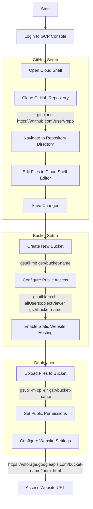

# GCP Static Website Workshop

A simple template repository for hosting a static personal portfolio website on Google Cloud Storage. This workshop demonstrates how to deploy a static website using GCP services.

## Workshop Overview

This hands-on workshop will guide students through:
1. Setting up a GitHub repository
2. Creating a Google Cloud Storage bucket
3. Configuring static website hosting
4. Deploying a personal portfolio website

## Workshop Flow



## Prerequisites

- Google Cloud Platform account
- Basic knowledge of command line
- GitHub account (optional)

## Step-by-Step Instructions

### 1. Access Google Cloud Console

1. Go to [Google Cloud Console](https://console.cloud.google.com/)
2. Sign in with your Google account
3. Create a new project or select an existing one

### 2. Open Cloud Shell

1. Click the Cloud Shell icon in the top-right corner
2. Wait for the shell to initialize

### 3. Clone the Repository

```bash
# Clone this repository
git clone https://github.com/your-username/gcp-static-website.git

# Navigate to the project directory
cd gcp-static-website
```

### 4. Customize Your Website

1. Open the Cloud Shell Editor
2. Edit `index.html` to personalize your information:
   - Update your name, title, and course information
   - Modify the about section
   - Update social links and contact information
   - Customize skills and other details

### 5. Create a Storage Bucket

```bash
# Create a new bucket (replace 'your-bucket-name' with a unique name)
gsutil mb gs://your-bucket-name

# Make the bucket publicly accessible
gsutil iam ch allUsers:objectViewer gs://your-bucket-name
```

### 6. Configure Static Website Hosting

```bash
# Set the main page for your website
gsutil web set -m index.html gs://your-bucket-name
```

### 7. Upload Your Website Files

```bash
# Upload all files to the bucket
gsutil -m cp -r * gs://your-bucket-name/
```

### 8. Access Your Website

Your website will be available at:
```
https://storage.googleapis.com/your-bucket-name/index.html
```

## File Structure

```
gcp-static-website/
├── index.html          # Main website file
├── styles.css          # CSS styling
└── README.md          # This file
```

## Customization Guide

### Personal Information
Edit the following sections in `index.html`:

- **Header**: Update name and title
- **About Me**: Modify the description
- **Course Information**: Update course, college, and semester
- **Contact**: Update LinkedIn URL and email
- **Skills**: Modify the skills list

### Styling
Customize `styles.css` to:
- Change colors and fonts
- Modify layout and spacing
- Add animations or effects
- Update responsive design

## Tips for Workshop

1. **Have the repository URL ready** - Pre-share the GitHub repository link
2. **Pre-create the buckets if possible** - Set up buckets beforehand to save time
3. **Test the commands beforehand** - Verify all commands work in your environment
4. **Have backup copies of files** - Keep original files as backup
5. **Prepare troubleshooting steps** - Common issues and solutions

## Common Issues and Solutions

### Bucket Name Already Exists
```bash
# Try a different bucket name
gsutil mb gs://your-bucket-name-2024
```

### Permission Denied
```bash
# Ensure you have the correct permissions
gcloud auth list
gcloud config set project YOUR_PROJECT_ID
```

### Website Not Loading
1. Check bucket permissions: `gsutil iam get gs://your-bucket-name`
2. Verify files are uploaded: `gsutil ls gs://your-bucket-name/`
3. Check website configuration: `gsutil web get gs://your-bucket-name`

## Optional Enhancements

1. **Add GitHub Actions** for automatic deployment
2. **Setup Cloud Build triggers** for CI/CD
3. **Implement version control** with proper branching
4. **Add cache control headers** for better performance
5. **Custom domain setup** with Cloud DNS
6. **SSL certificate** configuration

## Next Steps

After completing this workshop, students can:

1. Learn about Cloud CDN for better performance
2. Explore Cloud Build for automated deployments
3. Set up custom domains with Cloud DNS
4. Implement CI/CD pipelines
5. Add dynamic content with Cloud Functions

## Resources

- [Google Cloud Storage Documentation](https://cloud.google.com/storage/docs)
- [Static Website Hosting Guide](https://cloud.google.com/storage/docs/hosting-static-website)
- [gsutil Command Reference](https://cloud.google.com/storage/docs/gsutil)
- [Cloud Shell Documentation](https://cloud.google.com/shell/docs)

## License

This project is open source and available under the [MIT License](LICENSE).

---

**Happy Learning! 🚀**

*This workshop template is designed to introduce students to cloud computing concepts through hands-on experience with Google Cloud Platform.*
